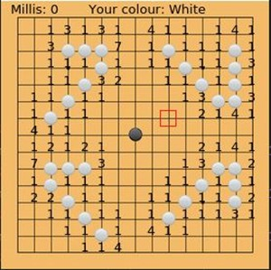

Author: Mark Lam 林呈欣(Lam Cheng Ian)

Email: marklamchengian@gmail.com

Date: June, 12th, 2021, 03:28

Description
------------
project 2: Gomoku
Game Name: The Gomoku v1.0

Story: Do you still remember the Brain Smashing game(project1)? After this previous brain ruining game, the computer found out there is not enough power to destroy all the humans' brains.
    Today the computer, the evilest creature on the Earth, has improved and became a really cunning powerful Demon -- the Artificial Intelligence(AI).
    It brings an ancient famous game the Gomoku to human beings! The Demon declared that it is gonna ruin humans' culture and happy life with its intelligence.
    And you! You are the last hope and the human Savior! I want you for the human army and save all of us from the evil Artificial Intelligence!
    God bless you, good luck ~~

The Demon incantation: GoMoKuKuMoGoMoKu !!!!!!

Platform information
---------------------
Cygwin Ver. 2.905, OS: Win10, 64-bit

Compilation Guide
------------------
1. File name "Makefile" is for compilation.
2. Set working directory to "Gomoku" and enter "make" to create an execution file named "Gomoku".
3. Open another terminal and enter "startxwin".
4. Execute /bin/pulseaudio.exe in Cygwin download folder by administrator.
5. Go back to original terminal and enter "export DISPLAY=:0.0".
6. Enter "./Gomoku" in original terminal. There are two options black and white chess. You can choose one of them be your weapon to defeat the computer.

7. In the game, use the four 'arrow keys' to select, and the 'Space' to ensure.
8. You can't pause the game because the Demon Computer won't let you, but it give you a chance with 15 seconds.
9. If you cannot defeat this powerful Demon, God has some secret weapons for you, which is cheatMode!
    To access this righteous power from God, you can set 'cheatMode' into 1 in the 19th line of 'window_Gomoku.h'.

Basic requirements
------------------
Show chess and board on the screen ------ done
Compete with computer ------ done
The size of board is 15 × 15 ------ done
Black chess played first ------ done
Take turns to play black chess and white chess ------ done
Play one chess per turn ------ done
Win if 5 of your chess connected in a row/column/diagonal ------ done
If more than 5 chess connected, continue the game ------ done
If no chess can win until the board is out of space, the game ended in a tie ------ done
Use keyboard arrow key or mouse to play the chess ------ done

Bonus
------
Extremely clever and cunning Algorithm of computer ------- done
Interesting heroic background story ---------------------- done
You can decide your chess colour and order --------------- done
Showing time on the screen, which human has 15 sec ------- done
Fabulous art work design of user interface --------------- done
Useful cheat mode to give you some great ways to chess --- done
Two debug modes let you understand the AI operation ------ done

Hope you enjoy the game The Gomoku, and save the world from the Demon computer :)
